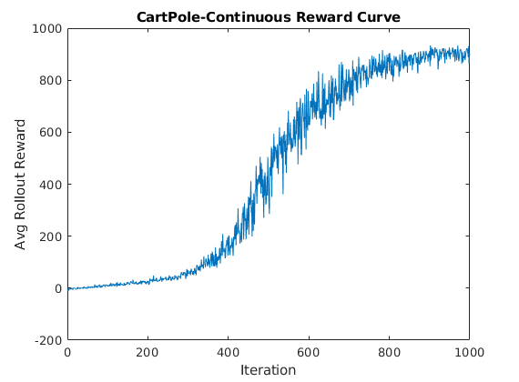
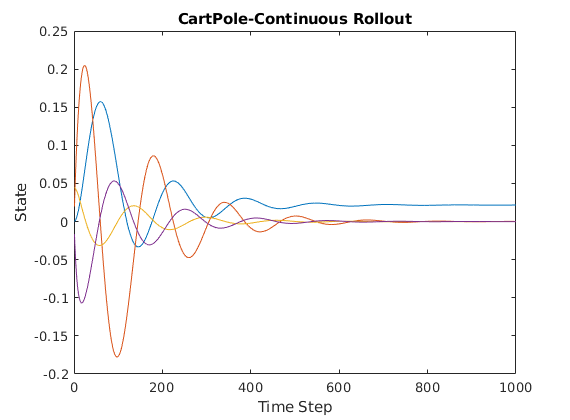

# Augmented Random Search For Reinforcement Learning in MATLAB

## What is this? 

An implementation of [Augmented Random Search](https://arxiv.org/abs/1803.07055) in Matlab. It supports Matlab environments compatible with the [Matlab RL Toolbox](https://www.mathworks.com/products/reinforcement-learning.html). It also requires the [Parallel computing toolbox](https://www.mathworks.com/products/parallel-computing.html).

## Why should I use this?

ARS is a very simple, fast algorithm that can often outperform more complex state of the art reinforcement learning algorithms (Like PPO, SAC, TD3 etc.), *especially* when comparing to the official mathworks implementations (which in my experience are missing many of the performance tricks from more mature python implementations of these algorithms).

In addition MATLAB's JIT makes using ARS with simple MATLAB environments very fast, even more so when comparing to pure python implementations of say, a cartpole pendulum or similar. For most environments I've tested I see hundreds of thousands of steps per second. 

## How do I use this?
Just clone this repo anywhere on your computer, and add it to your MATLAB path. From there see the examples folder to get you started.

## Here's a reward curve

asdasd

